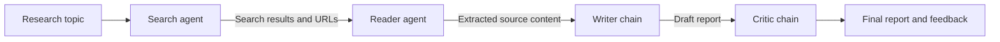

# LangChain Multi-Agent Research System

A multi-agent research workflow that turns a topic into a sourced, structured report. The system combines LangChain agents, Tavily web search, content extraction, and an LLM-based editorial review stage. A Streamlit dashboard provides a clear view of each agent as it runs and exposes the intermediate research state.

## Highlights

- Search the web for recent and relevant sources with Tavily.
- Select and scrape a high-value source for deeper context.
- Synthesize search results and extracted content into a professional report.
- Review the report with a dedicated critic chain that scores strengths and weaknesses.
- Monitor the active agent and inspect outputs for every pipeline stage in real time.
- Run the workflow from the Streamlit dashboard or directly from Python.

## Technology Stack

| Area | Technology |
| --- | --- |
| Language | Python 3.11+ |
| LLM orchestration | LangChain, LangChain Core, LangChain Community |
| Language model | OpenAI via `langchain-openai` (`gpt-4o-mini` by default) |
| Search | Tavily API |
| Web extraction | Requests, Trafilatura, Readability, BeautifulSoup, lxml |
| User interface | Streamlit |
| Configuration | `python-dotenv` |

## Agent Flow

The pipeline executes four sequential stages. Each stage updates the shared state and can emit a progress event to the dashboard.



### 1. Search agent

Uses a LangChain tool-calling agent with Tavily to find recent, reliable information and return source titles, URLs, and snippets.

### 2. Reader agent

Reviews the search results, chooses a relevant URL, and uses the scraping tool to extract readable content from that source.

### 3. Writer chain

Combines the search results and scraped content into a report containing an introduction, at least three key findings, a conclusion, and sources.

### 4. Critic chain

Evaluates the report and returns a score, strengths, weaknesses, improvement areas, and a one-line verdict.

## Project Structure

```text
.
├── app.py                    # Streamlit research dashboard
├── main.py                   # Direct Python entry point
├── requirements.txt          # Python dependencies
└── src/
	├── agents/
	│   └── agents.py         # Agents, prompts, and LLM chains
	├── pipeline/
	│   └── pipeline.py       # Four-stage orchestration and progress events
	└── tools/
		└── tools.py          # Tavily search and web scraping tools
```

## Prerequisites

- Python 3.11 or newer
- An OpenAI API key
- A Tavily API key

The default model is `gpt-4o-mini`. You can change the model or model parameters in `src/agents/agents.py`.

## Installation

### Option A: Conda

```bash
conda create -n langagent python=3.11 -y
conda activate langagent
pip install -r requirements.txt
```

### Option B: Python virtual environment

```bash
python -m venv .venv
```

Activate the environment:

```bash
# Windows PowerShell
.\.venv\Scripts\Activate.ps1

# macOS or Linux
source .venv/bin/activate
```

Then install the dependencies:

```bash
python -m pip install --upgrade pip
python -m pip install -r requirements.txt
```

## Configuration

Create a `.env` file in the project root:

```dotenv
OPENAI_API_KEY=your_openai_api_key
TAVILY_API_KEY=your_tavily_api_key
```

Do not commit `.env` or expose either key in source control. The application loads these values automatically with `python-dotenv`.

## Running the Dashboard

Start the Streamlit application from the project root:

```bash
streamlit run app.py
```

Open the local URL printed by Streamlit, enter a research brief, and select **Run research pipeline**. The dashboard displays:

- The currently active agent.
- Completion status for each stage.
- Expandable search, reader, writer, and critic outputs.
- The final report and critic review.
- The complete research state for deeper inspection.

## Running from Python

The direct entry point runs the pipeline with a sample topic:

```bash
python main.py
```

The pipeline can also be imported and called from another Python module:

```python
from src.pipeline.pipeline import run_research_pipeline

result = run_research_pipeline("The impact of AI on the job market in 2026")

print(result["report"])
print(result["feedback"])
```

To receive live stage updates, pass a callback:

```python
def show_progress(event: dict) -> None:
	print(event["stage"], event["status"], event["message"])


result = run_research_pipeline(
	"The impact of AI on the job market in 2026",
	progress_callback=show_progress,
)
```

## Pipeline State

`run_research_pipeline` returns a dictionary with these keys:

| Key | Contents |
| --- | --- |
| `search_result` | Tavily-backed search agent response |
| `scraped_content` | Extracted content from the selected source |
| `report` | Writer chain output |
| `feedback` | Critic chain evaluation |

Progress callbacks receive an event shaped like this:

```python
{
	"stage": "writer",
	"status": "running",
	"message": "Synthesizing the research into a report",
	"output": "",
}
```

## Troubleshooting

### Missing API key

Verify that `.env` is in the project root and contains both `OPENAI_API_KEY` and `TAVILY_API_KEY`. Restart Streamlit after changing environment variables.

### `create_agent()` rejects `llm`

This project uses the current `create_agent` interface, which passes the chat model using the `model=` keyword in `src/agents/agents.py`. Reinstall dependencies from `requirements.txt` if the installed LangChain packages are inconsistent.

### Scraping returns limited content

Some websites block automated requests or render content in the browser. The scraper uses several extraction strategies and returns the best content available, but source availability can vary by site.

## Notes

- Search and model calls can incur usage charges according to your OpenAI and Tavily accounts.
- Results depend on the freshness and accessibility of external sources.
- The system is intended to support research workflows; verify important claims against the original sources.